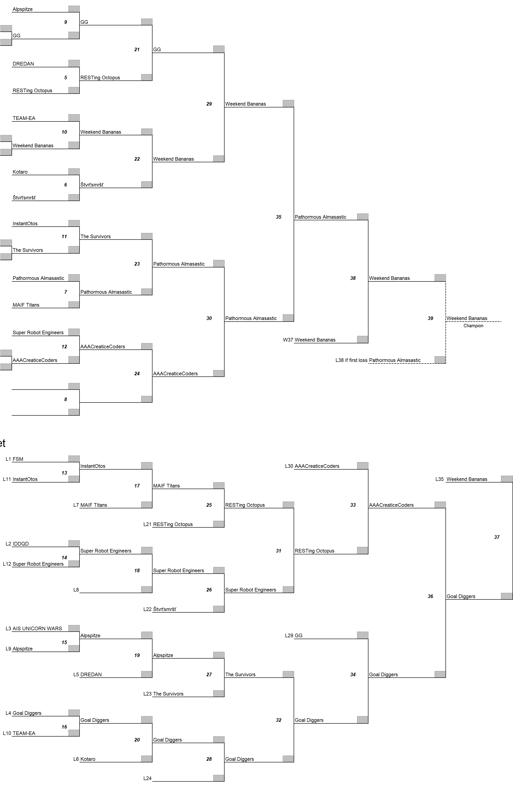
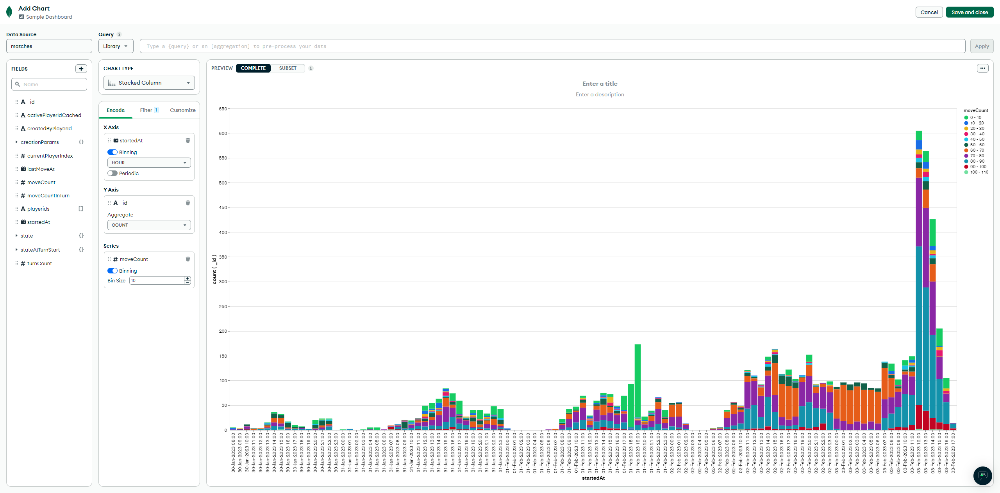
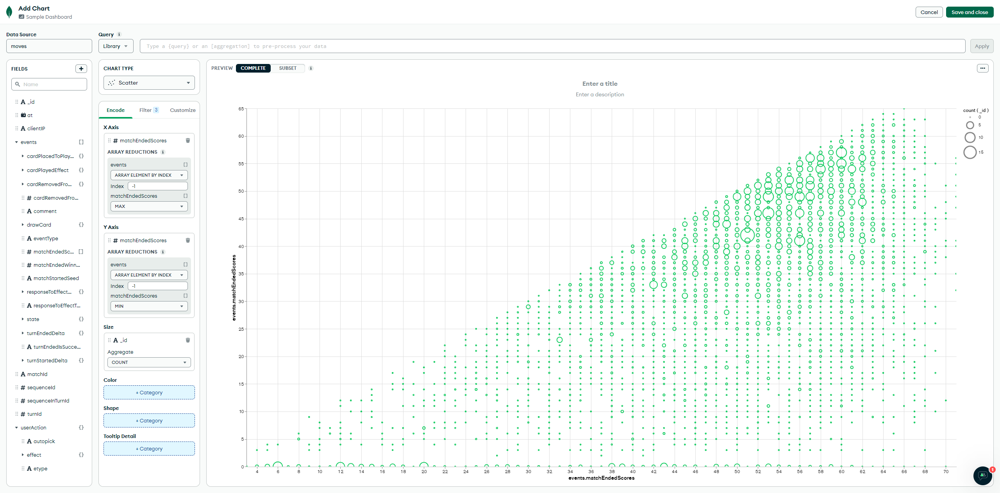
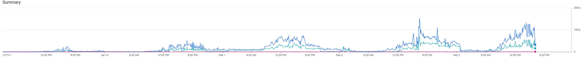
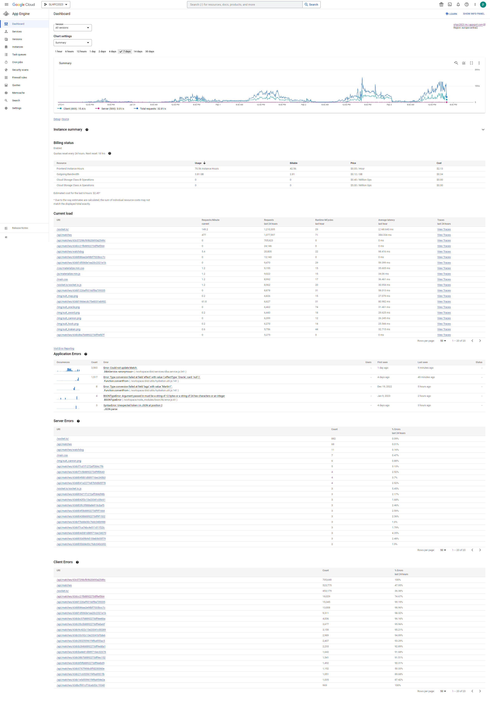

SAP Labs CEE Hub Programming Competition 2023
============

# Competition objective
The goal of each team is to implement a client to ace the [Dead-Man's-Draw](https://boardgamegeek.com/boardgame/149155/dead-mans-draw) card game using their language and tools of choice.

During the competition period there are be several practice tournaments, while the competition closes with a grand tournament where teams' solutions compete against each other and the most victorious teams ace the SLCEE-PC-2023.

The tournament is over and the results are [available](./data_statistics_charts).

# Programming Competiton and Game Rules
The competing teams have had the public documentation available about the tournament and the game rules, along with details on steep technical onboarding in the [public documentation](./doc/README_public.md).

Coplete API documentation is available and is published via [OpenAPI interface](https://slhpc2023.appspot.com/docs).

Example clients are available in [`./example_clients`](./example_clients) directory popular languages - Java, NodeJS JavaScript and a draft C#.

# Arena Server Architecture and Source Code
As the competition period is over and all matches and tournaments are finished the source code and the [rough architecture design](./doc/README_arena_server.md) is published.

Arena server source code is available through [./arena_server/src](./arena_server/src) directory.

## Database 

Screenshots about the final and practice tournaments are saved are are available along with the game flow of the [very last match](./data_statistics_charts/game_Day5_tournament_final_match.png).

For the data savvy colleagues some data analytics and statistical overviews are available as well such as number of moves per match or match ending scores.

If you are interested on infrastructure and instance load such as the some million calls per day you will find both Google Cloud Platform and MongoDB statistics [`./data_statistics_charts`](./data_statistics_charts) such as GCP server load figures during the tournament days.

